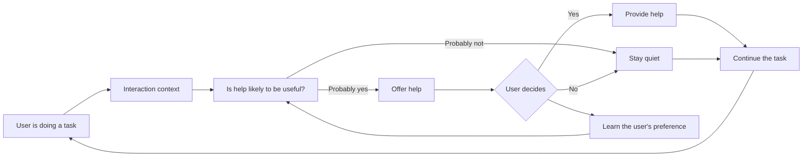

# Proactive AI

An AI assistant that knows when to help
Final project for the Building AI course

## Summary

Most AI assistants wait for us to ask for help. But sometimes the difficult part is knowing that help is available, or even knowing what to ask.

This project explores a more proactive assistant, it notices when someone seems to be struggling with a digital task and offers help at the right moment, without taking over.

## Background

We have all had moments when a website or online form just does not make sense. You might spend several minutes on one field, go back and forth between the same two pages, or keep changing an answer because you are not sure what the service is asking for.
An AI assistant could probably help, but the problem is that today's assistants usually wait for you to ask. That works well when the user knows what they need. It works less well when someone is already confused, does not know what to ask, or may not think of asking an AI assistant at all.
This is where the HCI question becomes interesting: can an AI recognise that someone might need help before they explicitly ask for it?

I'm particularly interested in situations where digital services create unnecessary barriers for people with limited digital experience or accessibility needs. But this is not only an accessibility problem. Almost anyone can get stuck when using an unfamiliar or badly designed service.
The challenge, then, is not just making AI capable of helping. It is making it sensitive enough to know when help is welcome and when it should simply stay out of the way.

## How is it used?

Imagine someone filling in an online application. 
Most of the time, the assistant stays quiet. Then the user gets to one part of the form and stops there for much longer than usual. 

They change the same field several times, they open an information page, return to the form, and then go back to the information page again. 
These small signals suggest that something may be unclear. 
The assistant does not fill in the field or make a decision for the user, it simply asks:
It looks like this step might be unclear. Would you like me to explain it?

Maybe the user says yes. Maybe they ignore it. They can also tell the assistant that they do not want this kind of suggestion again. The assistant makes help available, while the decision to use it stays with the user.

## How it works

There are really two questions here: when should the AI help, and when should it stay quiet? What the assistant says comes after that decision.

## Data sources and AI methods

An early prototype would not need a large amount of personal data. It could start with fairly simple interaction signals: how long someone stays on a step, whether they keep returning to the same page, repeated edits or clicks, previous requests for help, and whether earlier suggestions were accepted or dismissed.
These signals can become numerical features for a classifier, the model can then estimate how likely it is that help would be useful right now.

For instance: `P(help would be useful | current interaction)`. A low probability means doing nothing. Once the probability becomes high enough, the assistant can offer help. Only then does a language model need to become involved. It could explain a confusing instruction, answer a question about the current task, or help the user understand their options.

I like this separation because "when should I speak?" and "what should I say?" are different problems. A system can be very good at answering questions and still be terrible at knowing when its answers are wanted.
For a first experiment, the interaction data could simply be simulated. A more serious version would need user studies, where people can tell us whether the assistant intervened at useful moments or just got in the way.

## Challenges

Getting this wrong could be irritating very quickly. Someone who spends a long time on a page may simply be reading carefully. Moving between two pages might mean confusion, but it could just as easily mean that the user is comparing information. Behaviour that looks like "struggling" from the outside does not always mean that help is needed.

False positives therefore matter. An assistant that constantly pops up with "Do you need help?" is probably worse than one that waits for a prompt.

There is also an privacy problem. Detecting these patterns requires some awareness of what the user is doing, but that does not mean every click or action should be recorded. Ideally, much of this processing would happen locally, and temporary interaction data would disappear when it was no longer useful.
Autonomy matters for the same reason. The assistant should offer, not decide. Suggestions need to be easy to dismiss, and users should be able to choose how proactive they want the system to be.

This also changes what "good performance" means. Accuracy alone is not enough. I would want to know how often the assistant interrupts unnecessarily, how often people accept its help, whether they complete tasks more easily, and whether they still feel in control.

## What next?

I would start small: can a model distinguish ordinary interaction from situations where a person is likely to need help?
If that works, the more interesting question is timing. Help offered too early becomes an interruption. Help offered too late is not very helpful.

Personalisation could come later. One person might appreciate frequent suggestions; another might want the assistant to stay silent unless there are very strong signs of difficulty. Over time, the system could learn those preferences rather than treating everyone in the same way. I would also like to explore how much of this can run locally. Keeping interaction context on the user's own device could make proactive assistance much more privacy friendly.
Ultimately, I'm interested in moving beyond AI that only reacts to commands. A useful proactive assistant should understand enough of the situation to recognise when it can help, while also knowing that sometimes the best thing it can do is nothing.

## Acknowledgments

This project was developed as part of the Building AI course.

The project was also inspired by research on human-AI interaction:

- Amershi, S., Weld, D., Vorvoreanu, M., et al. (2019). [Guidelines for Human-AI Interaction](https://doi.org/10.1145/3290605.3300233). *Proceedings of the 2019 CHI Conference on Human Factors in Computing Systems (CHI '19).*
